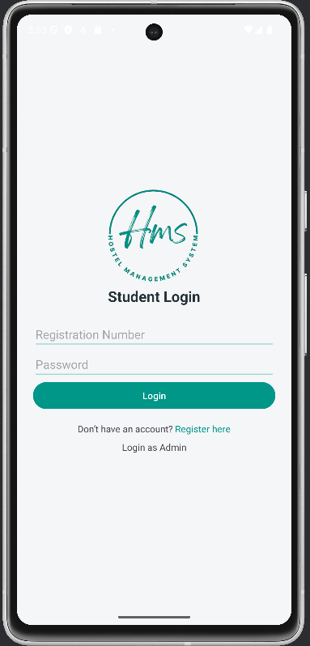
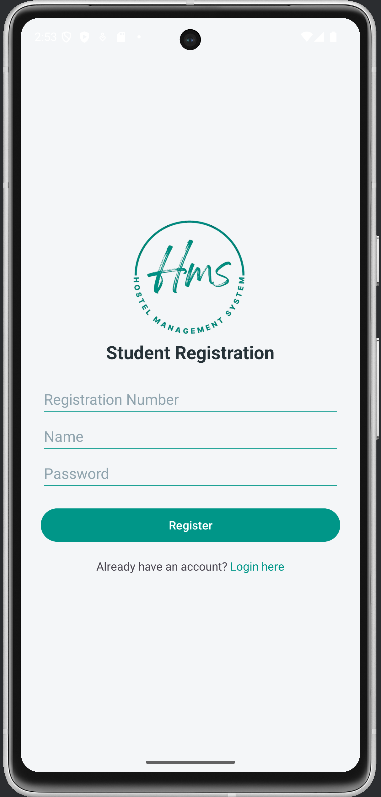
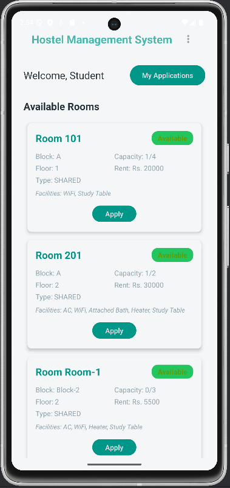
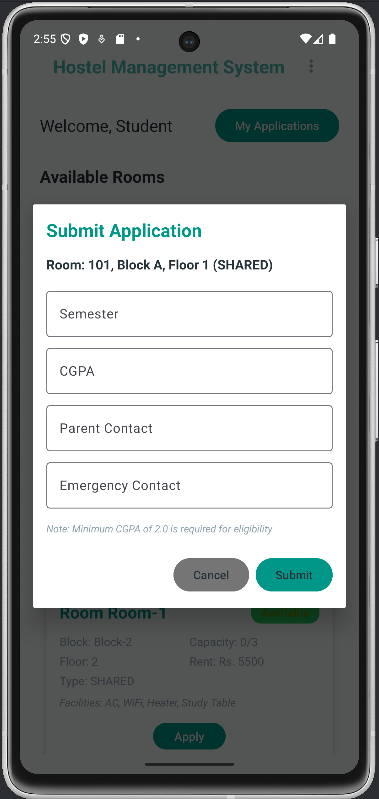
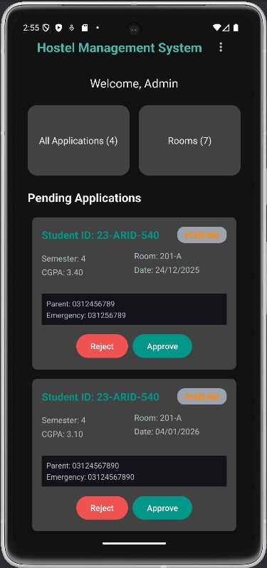
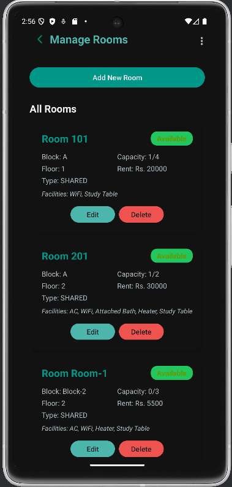
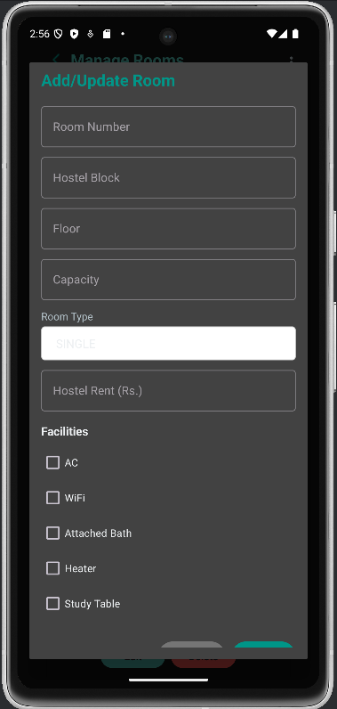
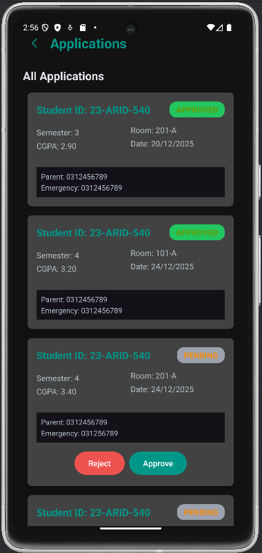

# Hostel Management System (Android App)

A comprehensive **Hostel Management System** for students and administrators built with **Android Studio** using **Java**, **Firebase Realtime Database**, **RecyclerView**, and **REST APIs**. The application supports role-based authentication, theme management, complete CRUD operations for rooms, student applications, and portfolio integration via WebView.

---

## 📋 Features

### Authentication & User Management
- ✅ Role-based authentication for **Admin** and **Student**
- ✅ Student registration with validation
- ✅ Secure login for both admin and students
- ✅ Session management with role-based access control

### Room Management (Admin)
- ✅ Add rooms with details (room number, block, floor, capacity, type, rent)
- ✅ Update room information and availability status
- ✅ Delete rooms from the system
- ✅ View all rooms with real-time occupancy updates
- ✅ Support for room facilities (AC, WiFi, Attached Bath, Heater, Study Table)
- ✅ Room type selection (Single/Shared)
- ✅ Add sample rooms via REST API integration

### Student Features
- ✅ View available rooms filtered by availability
- ✅ Submit hostel applications for available rooms
- ✅ Track application status (Pending/Approved/Rejected)
- ✅ View personal application history
- ✅ Access developer portfolio via in-app WebView

### Application Management (Admin)
- ✅ View all pending applications
- ✅ Approve/Reject applications
- ✅ Add rejection reasons
- ✅ Real-time application status updates
- ✅ Application count statistics

### UI & User Experience
- ✅ Light and Dark theme switching
- ✅ Persistent theme preference using **SharedPreferences**
- ✅ Material Design components (TextInputLayout, Buttons, RecyclerView)
- ✅ Responsive layouts for different screen sizes
- ✅ Progress indicators during data loading

### Additional Features
- ✅ Global options menu (Theme, Portfolio, Logout)
- ✅ WebView integration for portfolio display
- ✅ Input validation and error handling
- ✅ Toast notifications for user feedback
- ✅ Comprehensive logging for debugging

---

## 🛠️ Technology Stack

| Technology | Purpose |
|-----------|---------|
| **Android Studio** | IDE & Development Environment |
| **Java** | Backend Logic |
| **XML** | UI Layout Design |
| **Firebase Realtime Database** | Cloud Data Storage |
| **RecyclerView** | List Display & Adaptation |
| **Custom Adapters** | Data Binding |
| **WebView** | In-App Browser (Portfolio) |
| **SharedPreferences** | Local Data Persistence |
| **HttpURLConnection** | REST API Integration |
| **AsyncTask** | Background Operations |
| **Material Components** | Modern UI Elements |

---

## 📱 Application Architecture

### MVC Pattern Implementation
```
Model (Room, Student, HostelApplication)
  ↓
Controller (HMSController)
  ↓
View (Activities, Fragments, Adapters)
```

### User Flow

**Student Journey:**
```
Login → View Available Rooms → Submit Application → Track Status → View Portfolio
```

**Admin Journey:**
```
Login → Manage Rooms (CRUD) → View Applications → Accept/Reject → View Statistics
```

---

## 🚀 Setup Instructions

### Prerequisites
- Android Studio (latest version)
- JDK 11 or higher
- Android SDK 21 (API 21) or higher
- Firebase account

### Installation Steps

1. **Clone the repository:**
   ```bash
   git clone https://github.com/yourusername/hostel-management-system.git
   cd hostel-management-system
   ```

2. **Open in Android Studio:**
   - File → Open → Select project folder
   - Let Android Studio sync Gradle files

3. **Configure Firebase:**
   - Go to [Firebase Console](https://console.firebase.google.com)
   - Create a new project
   - Add Android app to project
   - Download `google-services.json`
   - Place it in `app/` folder

4. **Build and Run:**
   - Connect device or start emulator
   - Click "Run" button or press `Shift + F10`
   - App will install and launch

### Default Test Credentials

**Admin Login:**
- Email: `admin@hms.com`
- Password: `Admin@123`

**Student Registration:**
- Register with any registration number and password
- Use registration number for login

---

## 📸 Screenshots

### Authentication
| Student Login | Student Register | Admin Login |
|:---:|:---:|:---:|
|  |  |  |

### Student Dashboard
| Dashboard | Submit Application |
|:---:|:---:|
|  |  |

### Admin Dashboard
| Dashboard | Manage Rooms | Add Room |
|:---:|:---:|:---:|
|  |  |  |

| Available Rooms |
|:---:|
|  |

### Application Management
| View Applications |
|:---:|
|  |

---

## 📁 Project Structure

```
HostelManagementSystem/
├── src/main/java/com/example/hostelmanagementsystem/
│   ├── ui/
│   │   ├── activity/
│   │   │   ├── LoginActivity.java
│   │   │   ├── StudentDashboardActivity.java
│   │   │   ├── AdminDashboardActivity.java
│   │   │   ├── PortfolioActivity.java
│   │   │   └── ...
│   │   ├── adapter/
│   │   │   ├── RoomAdapter.java
│   │   │   ├── ApplicationAdapter.java
│   │   │   └── ...
│   │   └── helpers/
│   │       ├── AddUpdateRoomDialog.java
│   │       └── SubmitApplicationDialog.java
│   ├── controller/
│   │   └── HMSController.java
│   ├── model/
│   │   ├── Room.java
│   │   ├── Student.java
│   │   ├── HostelApplication.java
│   │   └── ...
│   ├── enums/
│   │   ├── RoomType.java
│   │   ├── Facility.java
│   │   ├── UserRole.java
│   │   └── ApplicationStatus.java
│   ├── data/
│   │   └── FirebaseManager.java
│   └── callbacks/
│       └── Various callback interfaces
├── res/
│   ├── layout/
│   │   ├── activity_student_login.xml
│   │   ├── activity_student_dashboard.xml
│   │   ├── activity_admin_dashboard.xml
│   │   ├── item_room.xml
│   │   └── ...
│   ├── menu/
│   │   └── common_menu.xml
│   ├── values/
│   │   ├── colors.xml
│   │   ├── strings.xml
│   │   └── themes.xml
│   └── drawable/
│       └── Various drawables
└── AndroidManifest.xml
```

---

## 🔑 Key Classes

| Class | Purpose |
|-------|---------|
| `HMSController` | Central controller for all operations |
| `Room` | Room data model |
| `Student` | Student data model |
| `HostelApplication` | Application data model |
| `RoomAdapter` | RecyclerView adapter for rooms |
| `ApplicationAdapter` | RecyclerView adapter for applications |
| `FirebaseManager` | Firebase database operations |
| `PortfolioActivity` | WebView activity for portfolio |

---

## ✨ Notable Implementations

### 1. REST API Integration
- Fetch room data from JSONPlaceholder API
- AsyncTask for background operations
- HttpURLConnection for network requests
- JSON parsing using JSONObject & JSONArray

### 2. Theme Management
- Light and Dark theme support
- AppCompatDelegate for theme switching
- SharedPreferences for persistence
- Activity recreation for theme application

### 3. Real-Time Updates
- Firebase Realtime Database listeners
- Automatic UI updates on data changes
- RecyclerView adapter notifications

### 4. WebView Integration
- In-app portfolio browsing
- JavaScript support
- Progress indication
- Error handling

---

## 🚦 Future Enhancements

- [ ] Push notifications for application status updates
- [ ] Email notifications for admins
- [ ] Room availability notifications
- [ ] Payment gateway integration
- [ ] Student profile customization
- [ ] Advanced filtering and search
- [ ] Offline mode with local caching
- [ ] Analytics dashboard for admins
- [ ] User feedback and ratings system
- [ ] Hostel announcements feature

---

## 🤝 Contributing

Contributions are welcome! Please follow these steps:

1. Fork the repository
2. Create a feature branch (`git checkout -b feature/AmazingFeature`)
3. Commit changes (`git commit -m 'Add AmazingFeature'`)
4. Push to branch (`git push origin feature/AmazingFeature`)
5. Open a Pull Request

---

## 📄 License

This project is licensed under the MIT License - see the LICENSE file for details.

---

## 👨‍💻 Author

**Ahmad** – Full Stack Developer  
🌐 Portfolio: [https://ahmadev.site](https://ahmadev.site)  
📧 Email: work.ahmad889@gmail.com

---

## 🙏 Acknowledgments

- Firebase for real-time database services
- Android Material Design guidelines
- Open source community contributions
- University guidance and support

---

## 📞 Support

For issues, questions, or suggestions, please:
- Open an [GitHub Issue](https://github.com/Ahmad-889/HostelManagementSystem/issues)
- Contact: [Portfolio](https://ahmadev.site)

---

**Last Updated:** January 2026  
**Version:** 1.0.0
